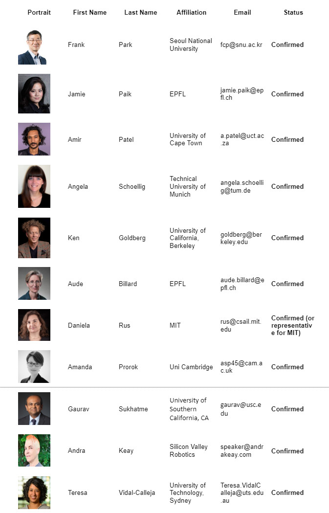
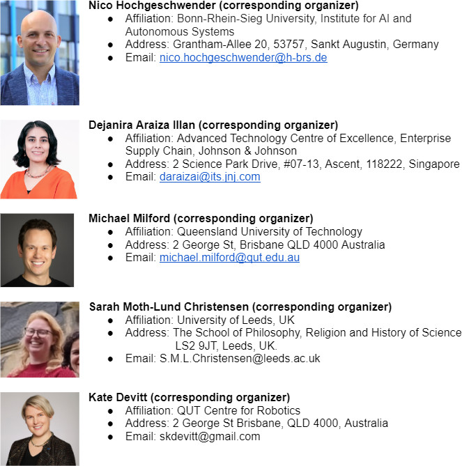

## What does Responsible Robotics mean?: Stretching roboticists’ horizons from an academic, government and philosophical perspective

With the imminent prospect of ubiquitous robotics in our everyday lives built off the back of transformative new changes in generative AI, as well as the ongoing debate around military robotics, autonomous vehicles and societal impact ranging from job losses to human empowerment, the time has never been more suitable for a discussion at the world’s leading robotics conference about what exactly Responsible Robotics entails. Building off a long legacy of consideration of this issue in robotics, most recently culminating in a Dagstuhl seminar on a Roadmap to Responsible Robotics, this workshop will bring together some of the leading roboticists, philosophers of moral responsibility and practical ethicists to teach, discuss and debate the key issues. A growing hunger and interest in this topic in both the robotics community and wider society suggests this will be a popular, engaging and thought provoking workshop.

### Contents

The workshop will bring together experts beyond robotics, in the areas of philosophy, focusing on moral and practical ethics …, and industries including …. Our main goal is to discuss, with a highly self-reflective angle, the state-of-the-art in the domain of .. A major goal is to build common ground on the concept of responsible robotics, working from philosophical conception into the practical efforts being made in contemporary robotics.... Additionally, we aim to open new avenues for future interdisciplinary collaboration among participants and expect that this will significantly advance the field of responsible robotics.

The format of the workshop comprises four sessions. We will start with a tutorial on “Responsible robotics 101”. Then we will follow with two sessions with a well thought mix of invited talks with time for Q&A with the audience, and fourth session with a dedicated panel of experts and a moderator. The diversity of expertise will encourage a cross-domain perspective in ... The invited talks will cover state-of-the-art challenges, developments, combined efforts and collaborations. Furthermore, the flow of the invited talks has been decided to ensure a good mix of academic, government and philosophical points of view, as well as theoretical and practical approaches.

### Plan to solicit participation

- We have extended individual invitations to a large list of speakers with a wide range of backgrounds (age, expertise, geographical areas, career stages, gender), to promote an inclusive environment for discussion and exchange of ideas.  
- We will advertise the workshop via global and regional mailing lists, e.g robotics-worldwide, and leveraging on the IEEE RAS TC’s mailing lists.

### Plan to encourage interaction among participants

The flow of the event will encourage the participants to learn, ideate and conceptualize throughout. There will be multiple Q&A instances during the tutorial, invited talks and panel discussion, guided by moderators. Questions will be collected digitally before and during the event. An online chat will be made available to continue with offline discussions.

#### Format

## Schedule

Tentative:

     

## Invited Speakers and Panelists

     

## Organizers

     

