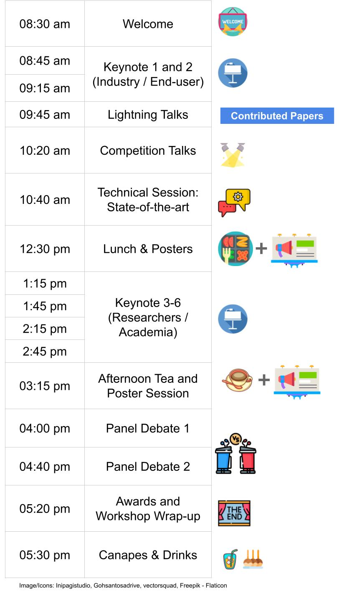
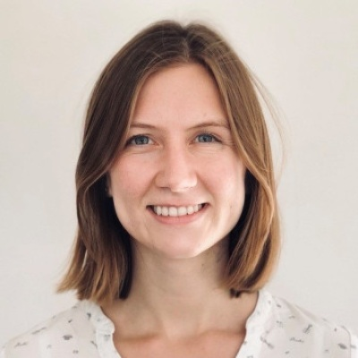
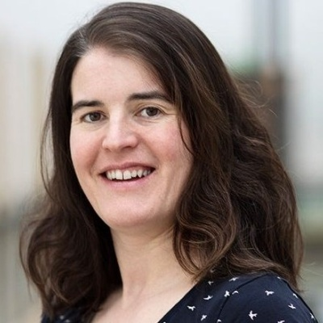
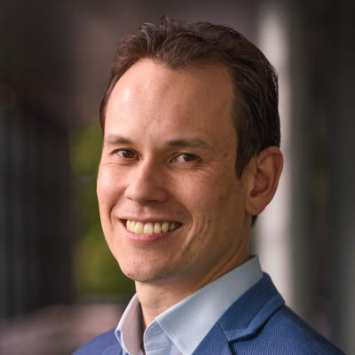
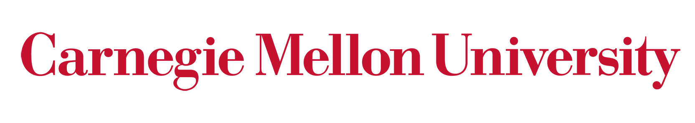

## What does Responsible Robotics mean?: Stretching roboticists’ horizons from an academic, government and philosophical perspective

With the imminent prospect of ubiquitous robotics in our everyday lives built off the back of transformative new changes in generative AI, as well as the ongoing debate around military robotics, autonomous vehicles and societal impact ranging from job losses to human empowerment, the time has never been more suitable for a discussion at the world’s leading robotics conference about what exactly Responsible Robotics entails. Building off a long legacy of consideration of this issue in robotics, most recently culminating in a Dagstuhl seminar on a Roadmap to Responsible Robotics, this workshop will bring together some of the leading roboticists, philosophers of moral responsibility and practical ethicists to teach, discuss and debate the key issues. A growing hunger and interest in this topic in both the robotics community and wider society suggests this will be a popular, engaging and thought provoking workshop.

### Contents

The workshop will bring together experts beyond robotics, in the areas of philosophy, focusing on moral and practical ethics …, and industries including …. Our main goal is to discuss, with a highly self-reflective angle, the state-of-the-art in the domain of .. A major goal is to build common ground on the concept of responsible robotics, working from philosophical conception into the practical efforts being made in contemporary robotics.... Additionally, we aim to open new avenues for future interdisciplinary collaboration among participants and expect that this will significantly advance the field of responsible robotics.

The format of the workshop comprises four sessions. We will start with a tutorial on “Responsible robotics 101”. Then we will follow with two sessions with a well thought mix of invited talks with time for Q&A with the audience, and fourth session with a dedicated panel of experts and a moderator. The diversity of expertise will encourage a cross-domain perspective in ... The invited talks will cover state-of-the-art challenges, developments, combined efforts and collaborations. Furthermore, the flow of the invited talks has been decided to ensure a good mix of academic, government and philosophical points of view, as well as theoretical and practical approaches.

### Plan to solicit participation

- We have extended individual invitations to a large list of speakers with a wide range of backgrounds (age, expertise, geographical areas, career stages, gender), to promote an inclusive environment for discussion and exchange of ideas.  
- We will advertise the workshop via global and regional mailing lists, e.g robotics-worldwide, and leveraging on the IEEE RAS TC’s mailing lists.

### Plan to encourage interaction among participants

The flow of the event will encourage the participants to learn, ideate and conceptualize throughout. There will be multiple Q&A instances during the tutorial, invited talks and panel discussion, guided by moderators. Questions will be collected digitally before and during the event. An online chat will be made available to continue with offline discussions.

#### Format

We invite you to submit high-quality research either as a 2-page extended abstract or a 4-page short paper. Page counts exclude references (i.e., 2 + n and 4 + n). You are encouraged to use IROS's suggested Latex [format](http://ras.papercept.net/conferences/support/tex.php) and upload a PDF (see below). The review process will be single blind, that is, the authors' names are not required to be anonymized, aligned with IROS paper submissions. We encourae submissions of work-in-progress and work that is not yet published.

Accepted papers will be presented as posters, with a selected few in the spotlight lightning session.

#### Submission Process
Please upload your paper through [OpenReview](https://openreview.net/group?id=IEEE.org/2023/IROS/Workshop/Localization). For extended abstracts, you can write N/A in the abstract field when creating a submission on OpenReview. Please use the TLDR field in the submission to indicate whether you are submitting "new work" or it is an "abridged version of a parallel/accepted submission". These papers will be publicly accessible through the workshop webpage in a non-archival format, thus allowing future submission to archival venues. At least one author must be registered to attend IROS 2023 workshops to present their work (see [registration](https://ieee-iros.org/registration-travel/)).

#### Important Dates (Papers)

[Due 23:59 UTC-0]

| Event                              | Date        |
|--------------------------------|-------------|
| Paper Submission Open           | 28 Jun 2023 |
| Paper Submission Due           | 24 Aug 2023 |
| Reviews Out                    | 08 Sep 2023 |
| Camera-Ready Due               | 20 Sep 2023 |
| Workshop Day                   | 01 Oct 2023 |

## Competition
From decades, place recognition has been applied to a range of localization and navigation tasks, but only a few methods have been proposed for large scale map assembling. On the other hand, with the development of autonomous driving, last mile delivery and multi agent cooperation, there is a huge demand for efficient and accurate large scale, crowd-sourced map updating. In this competition, General Place Recognition (GPR) for Autonomous Map Assembling, we provide a comprehensive evaluation platform of large scale LiDAR/IMU datasets,  repeatedly collected at different times in a variety of environments (city/park/indoor), with varying overlaps. The target is to assemble the joint large scale map based mainly on the place recognition ability without any GPS assistance.

We invite you to participate in the [competition](https://metaslam.github.io/competitions/iros2023/) led by Peng Yin (CityU HK) and Sebastian Scherer (CMU). The winners will have the opportunity to present their work at this workshop. The challenge timeline is as below:

[Due 23:59 UTC-0]

| Event                              | Date        |
|--------------------------------|-------------|
| Release Initial Dataset & Eval Tools           | 01 Aug 2023 |
| Release Final Competition Set           | 15 Sep 2023 |
| Submission Close                    | 24 Sep 2023 |
| Winners Notified                   | 25 Sep 2023 |
| Winners Presentations                   | 01 Oct 2023 |

## Prizes and Awards

The workshop will provide substantial prizes in the following categories:

- Best Overall Presentation Award, sponsored by Nvidia:
    - 1 Jetson Orin + RTX 4090 GPU and
    - Jetson Nano to each co-author to a max of 5 authors.
- USD 500 - Runner-up Paper Presentation Award, given to the student presenter at the lightning session.
- USD 500 - Runner-up Poster Presentation Award, given to the student presenter at the poster sessions.
- USD 200 - Most engaging speaker amongst our invited speakers.
- USD 200 - Most active participant, actively engaging throughout the workshop event.

## Support for Under-Represented Researchers

We aim to provide opportunities for all researchers to be able to attend and foster further research in this area. We are proposing this scholarship program for researchers from under-represented geographic regions and demographics, totaling USD 3,500, which they can use for:

- funding IROS 2023 workshop registration fees to enable attendance at this workshop
- travel grants providing partial or full support for travel to attend the physical conference
- hardware support including GPUs
- software license support to help with conducting research in this area

Please use this [form](https://forms.office.com/r/gY4wx3G63U) to apply for this support by **20 Aug 2023 (23:59 UTC-0)** (You will be informed of the outcome by 24 Aug 2023). Due to limited capacity, we cannot guarantee supporting everyone, but we encourage you to apply as it will only take a few minutes.

     

## Schedule

Tentative:

     

## Invited Speakers

### Academia

    

        
        <h2><a href="https://www.doc.ic.ac.uk/~ajd/">Andrew Davison</a></h2>
        
Professor Imperial College London

    

    

        
        <h2><a href="https://profiles.stanford.edu/gracegao">Grace Gao</a></h2>
        
Assis. Prof. Stanford

    

    

        
        <h2><a href="https://ayoungk.github.io/">Ayoung Kim</a></h2>
        
Assoc. Prof. Seoul National Uni.

    

    

        
        <h2><a href="https://facultyprofiles.hkust.edu.hk/profiles.php?profile=ming-liu-eelium">Ming Liu</a></h2>
        
Assoc. Prof. HKUST, Hong Kong

    

    

        
        <h2><a href="https://www.tu-chemnitz.de/etit/proaut/en/team/peerNeubert.html">Peer Neubert</a></h2>
        
Professor Uni. Koblenz

    

    

        
        <h2><a href="https://www.cs.cmu.edu/~./jeanoh/">Jean Oh</a></h2>
        
Assoc. R.Prof. CMU

    

    

        
        <h2><a href="https://tsattler.github.io/">Torsten Sattler</a></h2>
        
Sr. Researcher CTU

    

    

        
        <h2><a href="https://rpg.ifi.uzh.ch/people_scaramuzza.html">Davide Scaramuzza</a></h2>
        
Professor Uni. Zurich

    

    

        
        <h2><a href="https://ywang-zju.github.io/">Yue Wang</a></h2>
        
Assoc. Prof. Zhejiang University, China

    

    

        
        <h2><a href="https://www.edinburgh-robotics.org/academics/barbara-webb">Barbara Webb</a></h2>
        
Professor Uni. Edinburgh

    

### Industry

    

        
        <h2><a href="https://uk.linkedin.com/in/michaelmanganuk">Michael Mangan</a></h2>
        
Research Director Opteran Technologies

    

    

        
        <h2><a href="http://sandamirskaya.eu/">Yulia Sandamirskaya</a></h2>
        
Sr. Researcher Intel

    

    

        
        <h2><a href="https://www.linkedin.com/in/shubshrivastava">Shubham Shrivastava</a></h2>
        
Team Lead Perception, Kodiak Robotics

    

    

        
        <h2><a href="https://www.microsoft.com/en-us/research/people/olgavysotska/">Olga Vysotska</a></h2>
        
Research Scientist Microsoft

    

## Organizers

    

        
        <h2><a href="https://lucacarlone.mit.edu/">Luca Carlone</a></h2>
        
Assoc. Prof. MIT

    

    

        
        <h2><a href="https://v4rl.com/blog/chli-margarita-dr1676387386/the-lab">Margarita Chli</a></h2>
        
Assis. Prof. ETHZ

    

    

        
        <h2><a href="https://www.tobiasfischer.info/">Tobias Fischer</a></h2>
        
Lecturer QUT

    

    

        
        <h2><a href="https://profiles.stanford.edu/gracegao">Grace Gao</a></h2>
        
Assis. Prof. Stanford

    

    

        
        <h2><a href="https://researchers.adelaide.edu.au/profile/sourav.garg">Sourav Garg</a></h2>
        
Research Fellow Uni. Adelaide

    

    

        
        <h2><a href="https://research.csiro.au/mlai-fsp/our-people/our-postdocs/">Stephen Hausler</a></h2>
        
Research Scientist CSIRO

    

    

        
        <h2><a href="https://www.oru.se/english/employee/stephanie_lowry">Stephanie Lowry</a></h2>
        
Assoc. Sr. Lecturer Orebro University

    

    

        
        <h2><a href="https://www.qut.edu.au/research/michael-milford">Michael Milford</a></h2>
        
Professor QUT

    

    

        
        <h2><a href="https://www.linkedin.com/in/amir-patel/">Amir Patel</a></h2>
        
Assoc. Prof. Uni. Cape Town

    

    

        
        <h2><a href="https://www.ri.cmu.edu/ri-faculty/sebastian-scherer/">Sebastian Scherer</a></h2>
        
Assoc. Prof. CMU

    

    

        
        <h2><a href="https://www.microsoft.com/en-us/research/people/olgavysotska/">Olga Vysotska</a></h2>
        
Research Scientist Microsoft

    

    

        
        <h2><a href="https://maxtomcmu.github.io/">Peng Yin</a></h2>
        
Assis. Prof. CityU Hong Kong

    

## Organizations and Companies

<table class='myTable'>
  <tr style="border: hidden">
    <td style="border: hidden"></td>
    <td style="border: hidden"></td>
    <td style="border: hidden"></td>
  </tr>
  <tr style="border: hidden">
    <td style="border: hidden"></td>
    <td style="border: hidden"></td>
    <td style="border: hidden"></td>
  </tr>
  <tr style="border: hidden">
    <td style="border: hidden"></td>
    <td style="border: hidden"></td>
    <td style="border: hidden"></td>
  </tr>
</table>
